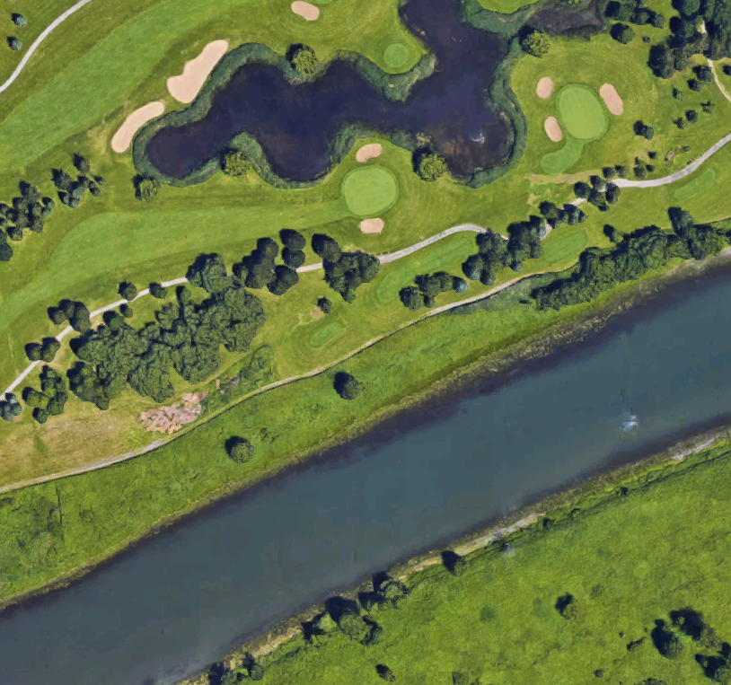

# Using kNN to annotate landscape photos

Th output of ~ 3 hours of playing around with the Image packages in `Julia`.
Running the `findWater.jl` script will open a series of pictures and ask for the
type (I used `grass`, `water`, `forest`, and `mixed`), then use k-Nearest
Neighbors to guess the rest of the image. It will then output something like
this:

~~~ raw
w w w w w w w w w ~ ~ ~ ~ ~ @ ~
w w w w w ~ ~ ~ @ ~ ~ @ w w w ~
w w w w ~ ~ ~ ~ ~ ~ ~ ~ w w w w
w w w ~ ~ ~ ~ ~ w ~ ~ @ w w w w
~ w w w w w w w w w w w @ @ w w
w w w w w w ~ ~ w w @ ~ w ~ ~ ~
w w w w ~ ~ w @ w ~ @ @ ~ ~ ~ ~
w ~ ~ ~ ~ @ w w w w w @ ~ ~ ~ ~
w ~ ~ @ @ w w w w w ~ ~ ~ ~ ~ ~
w w w w w w w w ~ ~ ~ ~ ~ ~ ~ ~
w w w w w @ ~ ~ ~ ~ ~ ~ ~ ~ ~ w
w w w w ~ ~ ~ ~ ~ ~ ~ ~ @ w w w
w w ~ ~ ~ ~ ~ ~ ~ ~ @ w w w w w
~ ~ ~ ~ ~ ~ ~ ~ ~ w w w w w w @
~ ~ ~ ~ ~ ~ @ w w w w w w w @ @
~~~

Which is the output of running it on this picture:

